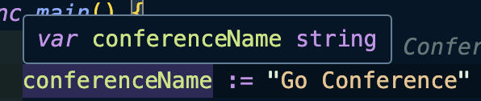

- references: https://www.youtube.com/watch?v=yyUHQIec83I

### go mod init <module path>
- Creates a new module
- Module path can correspond to a repository you plan to publish your module to (e.g. github.com/nana/booking-app)

- Initialized a `go.mod` file
- Describes the module: **with name/module path** and **go version** used in the program

### All our code must belong to a **package**
### The first statement in Go file must be "pageage ..."
### The "main" function is the entrypoint of a Go program
    - program has only one "main" function

### Go Packages
- Go programs are organized into packages
- Go's standard library, provides different core packages for us to use
- like "fmt" library
    - https://pkg.go.dev/fmt

### go run \<file name> : compiles and runs the code

### Go Compile's good thing
- Variable names must be used
- Imported packages must be used

## variable, constants
> var conferenceName = "Go Conference"  // variable
> const conferenceTickets = 50    // constants

### variable initialize
```go
var userName string
var userTickets int

userName = "Tom"
userTickets = 5

var someVar string = "some string value"
const someConst string = "some string const"
```

- 간략화

