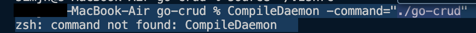
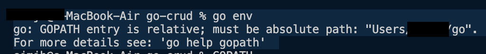

- references: https://www.youtube.com/watch?v=lf_kiH_NPvM

### library
- CompileDaemon
    - https://github.com/githubnemo/CompileDaemon
    - 해당 영상에선 글로벌로 설치함
        - `go install github.com/githubnemo/CompileDaemon`
    - trouble shooting
        
        
        - GOPATH=Users/{user}/go
            - https://stackoverflow.com/questions/74869522/compiledaemon-command-not-found-not-using-docker
            - 자동 설치된 go에 대한 환경변수가 상대위치로 지정되어 있을 수 있음
            - GOPATH= **/** Users/{user}/go
            ```shellscript
            vi ~/.zshrc
            
            export GOPATH="/Users/{user}/go"
            export PATH=$PATH:$GOPATH/bin

            source ~/.zshrc
            ```

            - https://github.com/githubnemo/CompileDaemon?tab=readme-ov-file#development
            ```shellscript
            vi ~/.zshrc
            export GO111MODULE="on"
            source ~/.zshrc
            ```
        - ⭐️`CompileDaemon -command="./go-crud"`⭐️

- godotenv
    - https://github.com/joho/godotenv
- gin
    - https://gin-gonic.com/docs/quickstart/
    - go get -u github.com/gin-gonic/gin
- gorm
    - https://gorm.io/index.html
    - postgres